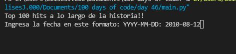
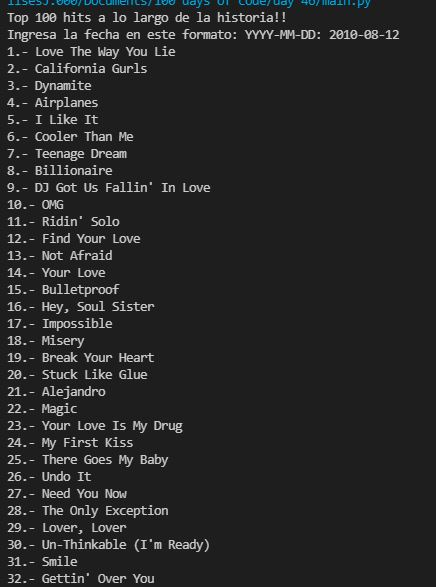
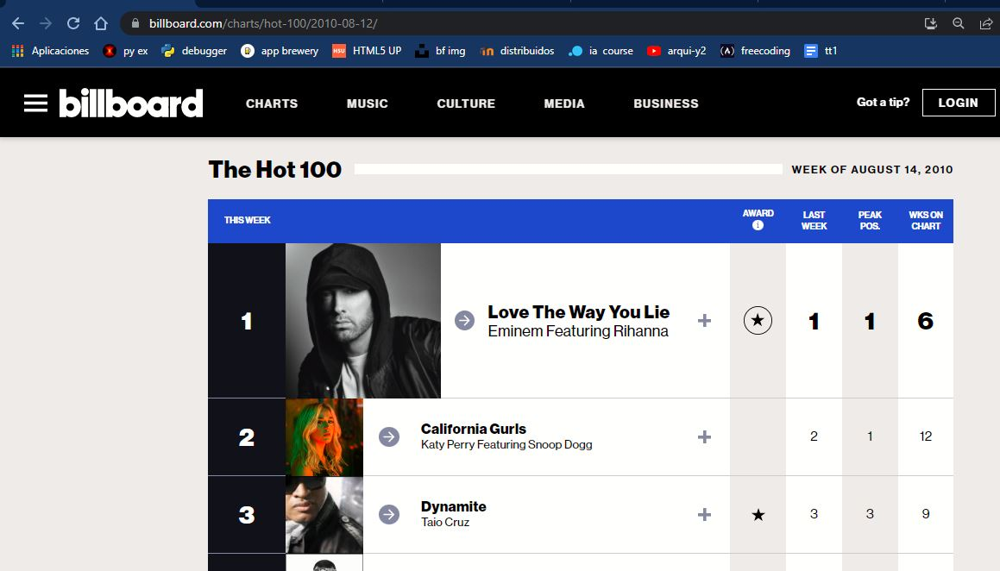

# Create a Spotify Playlist using the Musical Time Machine

Ingresamos la fecha de la que queremos obtener los exitos en formato YYYY-MM-DD

Ahora con beautiful soup recuperamos los datos de la pagina de Billboard.com

Echemos un vistazo para comprobar que efectivamente se trata de esas canciones

